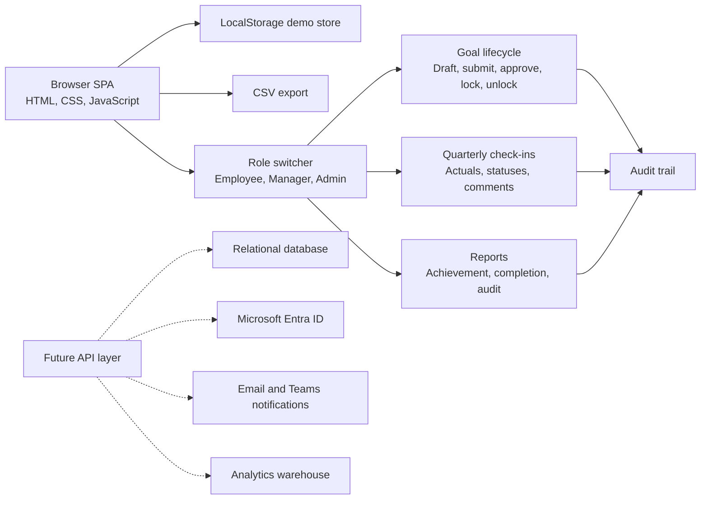

# Architecture Diagram

## Production path

- Replace `localStorage` with an authenticated API and relational database.
- Use Microsoft Entra ID for SSO, hierarchy sync, and role mapping.
- Add background jobs for reminder and escalation rules.
- Send notifications through email and Microsoft Teams adaptive cards.
- Move audit logging to an append-only table.
